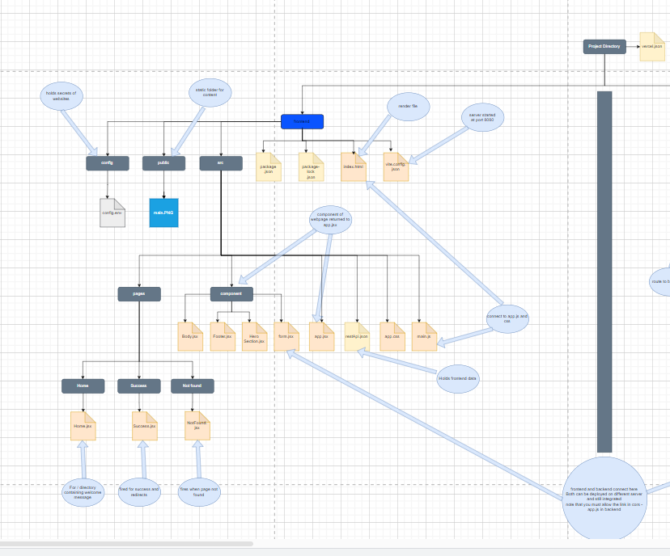
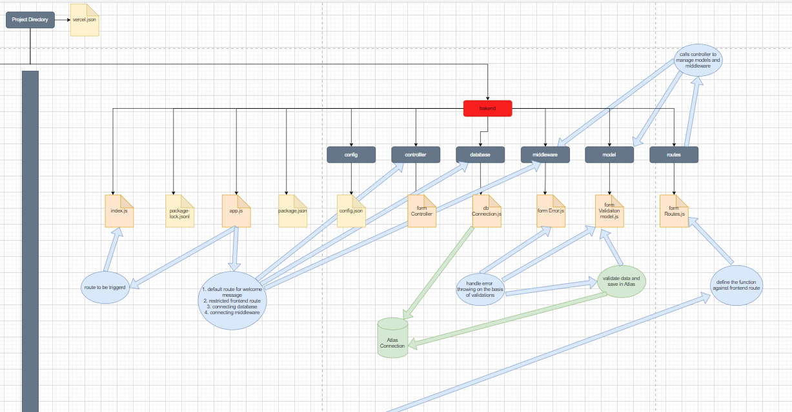

# see how the website is been structured to reuse it easily for other utilizind MVC concept
[# click here | draw.io link](https://drive.google.com/file/d/1xs-vqumhTuXOdpN9sO3Vec6rlQ1d3UaG/view?usp=sharing)
br
# Frontend image

# Backend image

